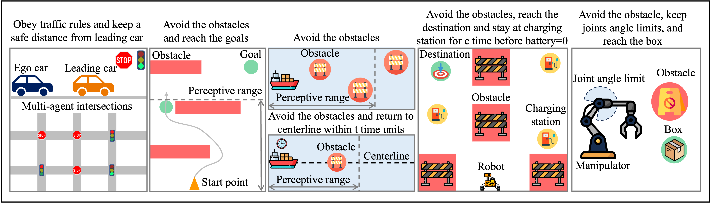
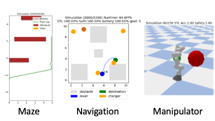

# Signal Temporal Logic Neural Predictive Control

[](https://ieeexplore.ieee.org/iel7/7083369/7339444/10251585.pdf)
[](https://2024.ieee-icra.org/index.html)

<!-- [](https://arxiv.org/abs/2309.05131.pdf) -->

[<ins>Reliable Autonomous Systems Lab @ MIT (REALM)</ins>](https://aeroastro.mit.edu/realm/)

[<ins>Yue Meng</ins>](https://mengyuest.github.io/), [<ins>Chuchu Fan</ins>](https://chuchu.mit.edu/)



> A differentiable learning framework to define task requirements and to learn control policies for robots.


This repository contains the original code and tutorial for our ICRA2024 paper, "Signal Temporal Logic Neural Predictive Control." [[link]](https://arxiv.org/abs/2309.05131.pdf)


```
@article{meng2023signal,
  title={Signal Temporal Logic Neural Predictive Control},
  author={Meng, Yue and Fan, Chuchu},
  journal={IEEE Robotics and Automation Letters},
  year={2023},
  publisher={IEEE}
}
```

 

## Prerequisite
Ubuntu 20.04 (better to have a GPU like NVidia RTX 2080Ti)

Packages (steps 1 and 2 suffice for just using our STL Library (see [tutorial](tutorial.ipynb))):
1. Numpy and Matplotlib: `conda install numpy matplotlib`
2. PyTorch v1.13.1 [[link]](https://pytorch.org/get-started/previous-versions/): `conda install pytorch==1.13.1 torchvision==0.14.1 torchaudio==0.13.1 pytorch-cuda=11.7 -c pytorch -c nvidia` (other version might also work )
3. Casadi, Gurobi and RL libraries: `pip install casadi gurobipy stable-baselines3 && cd mbrl_bsl && pip install -e . && cd -`
4. (Just for the manipulation task) `pip install pytorch_kinematics mujoco forwardkinematics pybullet && sudo apt-get install libffi7`

## Tutorial
You can find basic usage in our tutorial jupyter notebook [here](tutorial.ipynb).

## Experimental results
Please look at [`exp_scripts`](exp_scripts.sh) to reproduce the full experiments.
